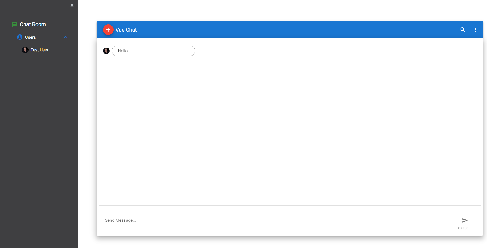

# SignalR project with .Net Core and Vue



## Goal

Real-time messaging app with signalR.


## Quick Start

1. Clone this repo.

2. Open a terminal and navigate to the client folder. Restore the dependencies with `npm install`, then run `npm run serve`. It will automatically reload when the client code changes.

3. Open a second terminal and navigate to the server folder. Restore the dependencies with `dotnet restore`, then run the server with `dotnet run`. Alternatively use `dotnet watch run` if you want to automatically reload when the server code changes.

4. The frontend will be listening on [http://localhost:8080](http://localhost:8080/) while the backend will be listening at [http://localhost:5200](http://localhost:5100/)


## What is signalR ?

SignalR is an open source .NET library written for developing real-time applications.With SignalR, a continuous connection is maintained between client and server. Instead of Request-Response, it calls the client-side Javascript on the server side in our browser with the RPC (Remote Procedure Calls) feature in SignalR. When there is a change in data, the Server calls a Javascript method and notifies the Client or Clients about it. But if HTTP protocol existed, we would have to refresh the page to make this update.


## Areas where it is used

- Social Media / Messaging Applications

- Real-Time Monitoring Applications
  
  

## What is a hub ?

Hub connection is a high-level API that allows us to directly call client and server methods written on the Persistence connection. It also provides methods with parameters and model binding.


## Configuration

Startup.cs

```c#
services.AddSignalR();
```

```c#
app.UseRouting();
app.UseEndpoints(endpoints =>
{
    endpoints.MapHub<ChatHub>("/chathub");
});
```

Program.cs

```c#
public class Program
    {
        public static void Main(string[] args)
        {
            CreateWebHostBuilder(args).Build().Run();
        }

        public static IWebHostBuilder CreateWebHostBuilder(string[] args) =>
            WebHost.CreateDefaultBuilder(args)
                .UseStartup<Startup>()
                .UseUrls("http://localhost:5200");
    }
```


## SignalR Mehods

> **All**: All users who log in with this command are shown in real time.
> 
> **AllExcept**: Shows changes triggered by all users except ourselves. When called as Clients.AllExpect (id), all the changes made to all users except the given Id are shown in real time.
> 
> **Caller**: When the current connection ID (logged in ID) makes a change, it shows the changes. Caller function can be given a specific user id called with Caller (id).
> 
> **Group**: Within a group, changes are triggered, except for the group name and our own connection ID.
